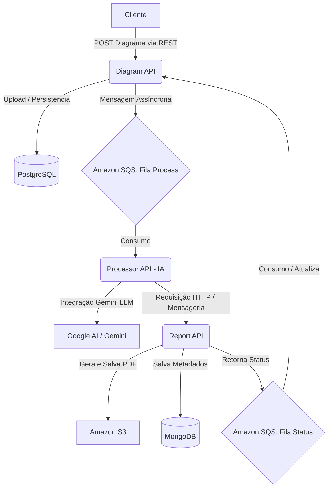

# Hackathon FIAP - Infraestrutura (IADT + SOAT)

Repositório principal de infraestrutura e orquestração do MVP da FIAP Secure Systems, focado em automatizar a análise técnica de diagramas de arquitetura de software utilizando microsserviços e Inteligência Artificial.

## O Problema

Empresas que operam sistemas distribuídos possuem dezenas de diagramas de arquitetura (imagens ou PDFs) utilizados em revisões, auditorias e avaliações. Analisar esses diagramas manualmente exige tempo, especialistas e não escala.

Este MVP permite que os usuários façam o upload de um diagrama e recebam um relatório automatizado (PDF) detalhando componentes, riscos arquiteturais e recomendações.

---

## Arquitetura da Solução

A solução baseia-se em uma arquitetura de **Microsserviços** na AWS com comunicação híbrida (REST e mensageria assíncrona):

### Componentes:
1. **Diagram API:** Recebe o diagrama, persiste o estado em PostgreSQL e publica o evento no SQS. Orquestrador principal.
2. **Processor API:** Serviço focado em IA. Consome da fila SQS, utiliza LLM (Google Gemini) para identificar componentes e riscos a partir da imagem do diagrama, repassa os dados estruturados.
3. **Report API:** Recebe os dados de análise técnica, gera o PDF usando PDFBox, armazena no Amazon S3 e emite o status final da operação (MongoDB e SQS).

---

## Requisitos Básicos de Segurança Adotados

Seguindo as premissas de um sistema maduro e seguro, adotamos diversas práticas em todas as APIs e infraestrutura (Terraform/Docker/AWS):

### 1. Validação e Tratamento de Entradas Não Confiáveis
- Todos os microsserviços possuem **Global Exception Handlers** (`@RestControllerAdvice`), impedindo vazamento de stacktraces para o usuário.
- Arquivos de upload são validados pela API (`multipart/form-data` limites e tamanhos), evitando ataques de esgotamento de recursos.
- Inputs via requisição HTTP são anotados com as bibliotecas do Spring Validation (evita injeções).

### 2. Uso Controlado dos Modelos de IA
- O envio das imagens e prompts para o LLM (Gemini) é restrito a **system prompts padronizados** com controle estrito de formatação e limites.
- Existe uma validação da estrutura retornada pela IA antes de repassá-la para o gerador de relatórios (prevenindo que alucinações da IA quebrem o parser do sistema).

### 3. Tratamento Seguro de Falhas (IA e Serviços)
- Se a IA falhar ao interpretar um diagrama ou demorar, a `Processor API` tratará o erro e atualizará o status da análise para `FAILED` na base de dados, permitindo reprocessamento e evitando que a fila SQS se acumule indefinidamente (Dead Letter Queues podem ser configuradas).
- Testes unitários com JaCoCo garantem validação da regra de negócio (acima de 80% de cobertura forçada na CI).

### 4. Práticas Mínimas de Segurança entre Serviços
- Uso de **Políticas IAM** específicas: O `Report API` tem política exclusiva de _PutObject_ no S3; a fila SQS possui permissões restritas. Nenhum serviço roda como _admin_.
- Credenciais não são expostas em código (uso contínuo de Github Secrets repassando variáveis no CI/CD via `appleboy/ssh-action` sem salvá-las fixas nos containers).

### 5. Riscos e Limitações de Segurança
- O relatório PDF é salvo em um bucket S3 (que dependendo da configuração no Terraform, pode estar público). Idealmente seria providenciado Presigned URLs para acesso temporário.
- Por se tratar de um MVP local/EC2, as chamadas HTTP internas poderiam ser protegidas por uma Service Mesh e o banco de dados restrito exclusivamente à VPC de backend.

---

## Fluxo de CI/CD e Observabilidade

- **CI/CD:** Há workflows automatizados de GitHub Actions em todos os repositórios, executando o `build`, rodando testes forçadamente e fazendo o deploy automatizado para AWS (ECR -> EC2 via docker compose / run).
- **Observabilidade:** As aplicações rodam as dependências do `logstash-logback-encoder` formatando as saídas em JSON estruturado, pronto para ingestão do CloudWatch ou ElasticSearch.

---

## Sub-Repositórios
- **[Diagram API](https://github.com/SOAT12/hackaton_diagram_api)**
- **[Processor API](https://github.com/SOAT12/hackaton_processor_api)**
- **[Report API](https://github.com/SOAT12/hackaton_report_api)**